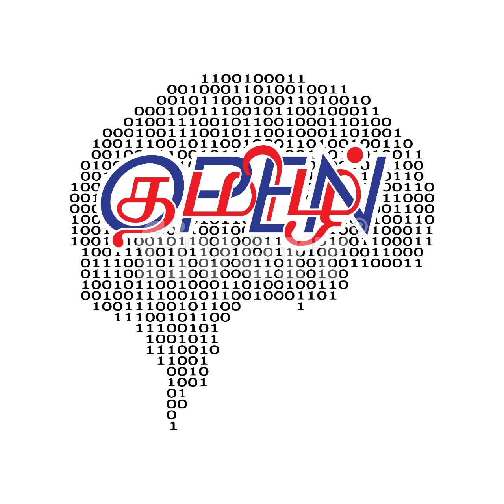

Open Source Tamil Tools and NLP Library for Python 3
======================================================
திற மூல தமிழ் கருவிகள் version 1.0
-------------------------------------
.. image:: https://travis-ci.org/Ezhil-Language-Foundation/open-tamil.svg?branch=main
    :target: https://travis-ci.org/Ezhil-Language-Foundation/open-tamil

மென்பொருள் (Software)
===================
பைதான் தொகுப்புகள் (Python  Packages)
-----------------------------------
'tamil' என்ற பைதான் தொகுப்பை வழங்குகிறோம்
=====================================
tamilstemmer
------------
This module is new in v0.96 provides access to simple stemmer functions
 originally created by Damodharan Rajalingam.

tamil
-----
open-tamil provides Python package 'tamil' with ability to,

1. map unicode code-points to Tamil letters - basic but important parsing - in a routine called get_letters from a Tamil word
   `tamil.utf8.get_letters` and `tamil.utf8.get_letters_iterable` API return the Tamil letters from the unicode points of a normalized unicode string.
   These routines are written with efficiency in mind, and tested for accuracy.

2. work with vowels (uyir) and consonants (mei), compound, uyir-mei letters
3. reverse letters in Tamil word
4. numeral - convert a given number (integer) into a numeral in Indian or American based system.
   e.g. following call will return the string
   >> tamil.numeral.num2tamilstr_american( long(1e7) )
   u"பத்து மில்லியன்",

txt2unicode
-----------
Tamil Text Encode to Unicode Converter and vice versa.
If you don't you know what your Tamil text encoding is, don't worry; the `tamil.txt2unicode.auto2unicode` function will find it and convert to unicode for you.
யுனிகோட் மாற்றி மற்றும் மாறாகவும் தமிழ் உரைக் குறியாக்கம்.
உங்களது தமிழ் உரைக் குறியீடு என்னவென்று தெரியாதெனில், நீங்கள் கவலை கொள்ளத் தேவையில்லை; `tamil.txt2unicode.auto2unicode` செயல்பாடு இதனைக் கண்டறியும் மற்றும் இதனை யுனிகோடுக்கு மாற்றும்.

Right now, it supports 25 known Tamil encodings. Read more details about [txt2unicode](tamil/txt2unicode/README.md) and [limitation](examples/txt2unicode/encodes_chars/README.md) of `auto2unicode` and `unicode2auto`.
தற்சமயம், இது 25 தமிழ் குறியாக்கம் கொண்ட எழுத்துருக்களை ஆதரிக்கிறது. [txt2unicode](tamil/txt2unicode/README.md) பற்றி மேலும் விவரங்களும் 'auto2unicode' மற்றும் 'unicode2auto'-வின் [குறைபாடுகளையும்] (examples/txt2unicode/encodes_chars/README.md) காண்க.

txt2ipa
-------
Tamil Unicode Text to International Phonetic Alphabet (IPA) converter
Read more details about [txt2ipa](tamil/txt2ipa/README.md)
சர்வதேச (ஐபிஏ) மாற்றி, தமிழ் யுனிகோட் உரை; மேலும் விபரங்களுக்கு -> படிக்க [இங்கு சொடுக்கவும்](tamil/txt2ipa/README.md).

transliterate
-------------
The python package `transliterate` provides for commonly used transliteration
phonetic schemes like,

1. Azhagi - phonetic maps for all Tamil letters - many -> one supporting multiple form inputs
2. Jaffna Library - phonetic maps for all Tamil letters - one->one
3. Combinational layout - based on phonetic mapping of vowel+consonant
4. University of Madras, ISO - transliteration schemes are added.

where you can supply English text, which phonetically encodes Tamil, and then receive Unicode encoded, in a best-effort algorithm for the longest phonetic match.

`transliterate` தொகுப்பு பொதுவாக பயன்படுத்தப்படும் ஒலிபெயர்ப்புகளை வழங்குகிறது; அவை,
1. அழகி - தமிழ் கடிதங்கள் ஒலிப்பு வரைபடங்கள் - பல -> ஒரு ஆதரவு பல வடிவம் உள்ளீடுகள்
2. யாழ்ப்பாண நூலகம் - தமிழ் கடிதங்கள் ஒலிப்பு வரைபடங்கள் - ஒன்று> ஒரு
3. பலதரப்பட்ட அமைப்பு - உயிர் + மெய் உச்சரிப்பு மேப்பிங் அடிப்படையில்

tamilmorse
----------
இந்த தொகுப்பில் தமிழுக்கான மோர்சு குறிகளை உருவாக்கவும், குறியீடுகளை
பிரித்துப்பார்கவும் முடியும்.

tamilsandhi
-------------
தமிழில் சந்திப்பிழை திருத்தி உருவாக்கவும் பிழைக திருத்தவும் உதவியாகஇந்த நிரல் தொகுப்பு வழிவகுக்கும். ஏரக்குறைய 40-விதிகளை கொண்டது இந்த நிரல் தொகுப்பை உருவாக்கியவர் திருமதி. நித்யா. மேலும் விவரங்களுக்க https://github.com/nithyadurai87/tamil-sandhi-checker
Tamil Sandhi Checker is a project created and maintained by Nithya Duraisamy,
with contributions from Ezhil Language Foundation. It is distributed under terms of GNU GPLv3.

For convenience this code is packaged with Open-Tamil.

C-tamil
-------
The package under C-tamil provides some of the same functionality as Python 'tamil' but in ISO-C for C/C++ use.
*சி தமிழ்*
பைதான் 'தமிழ்' தொகுப்பில் உள்ள சில பயன்பாடுகளை 'சி தமிழ்' ஐஎஸ்ஓ-சி-யில், சி/சி++ பயன்படுத்தும் வகையில் கொடுக்கும்.

திரை விசைப்பலகை (Onscreen Keyboard)
----------------------------------
Open-tamil provides the keyboard layout in the file `keyboard/tamil.js` for they jQuery UI plugin.
'tamil.js' விசைப்பலகை அமைப்பை வழங்குகிறது.

மாதிரிகள் (Language Modes)
-------------------------
Basic support for letter unigram, bigram models using UTF-8 based corpora are supported in the package 'ngram/'
which supports unigram model at the moment. More complex language models are expected to be developed soon.
எழுத்து unigram அடிப்படை ஆதரவு, மற்றும் UTF-8 அடிப்படையில் சொற்கிடங்கின் பயன்படுத்தி bigram மாதிரிகள் 'ngram/' தொகுப்பால் ஆதரிக்கப்படுகின்றன, தற்பொழுது அது மாதிரி unigram-ஐ ஆதரிக்கிறது. மிகவும் நுணுக்கமான மொழி மாதிரிகள் விரைவில் அபிவிருத்தி செய்யப்படும் என எதிர்பார்க்கப்படுகிறது.

நிறுவுதல் (Installation)
=======================
Installation from Python Package Index is also recommended, following the commands,

    $ pip install open-tamil

Installing from sources
=======================
After pulling sources from git repo you need to sync the submodule
for tamilsandhi by issuing the following commands,

$ git submodule init 
$ git submodule update --force

This is required for packaging, tamilsandhichecker, along with open-tamil.

உதாரணங்கள் (Example
===================
Open-Tamil is a set of Python libraries which can help your application - web, system software, GUI on desktop etc. support Tamil text processing, inputs etc.

Open-Tamil is still a basic collection of tools - its not complete yet. We have keyboard layouts, converters to change old encoding to UTF-8, N-gram language models, transliterators etc.

Examples for using Python Open-Tamil are found [here](tests/).

ஓபன்-தமிழ் என்பது தொகுக்கப்பட்ட பைதான் நூலகமாகும், உங்கள் வலை, ணினி நிரல், முகத்திரை வரைகலை மற்றும் பல தமிழ் எழுத்துரு செயற்பாடுகளுக்கு மிகவும் உவியாக இருக்கும்.
ஓபன்-தமிழ் என்பது அடிப்படை தொகுப்புக்களை மட்டுமே கொண்ட கருவிகளாும், இது இன்னும் முழுமை பெறவில்லை. இதில் UTF-8, என்-கிராம் மொழி மாதிரிகள், transliterators முதலியன பழைய முறையை மாற்ற விசைப்பலகை அமைப்பு, மாற்றிகள் உள்ளன. பைதான் ஓபன் தமிழ் பயன்படுத்தி உதாரணங்கள் [இங்கு](tests/) காணப்படுகின்றன.

இலக்குகள் (Goals)
=================
Goal of this package is to collect and develop open-source licensed Tamil tools, in one location that provide the following,

1. Unicode standard tools for Tamil - provide various tools for Tamil Unicode development. Currently 25 encodes are supported, read about it [here](tamil/txt2unicode/README.md)
2. Access Unicode Tamil letters, vowels and consonants.
3. Breakdown Tamil glyphs and unicode code-points into Tamil letter representations - collation
4. Tools for navigating a corpus of data, build word frequency, prediction tables etc.
5. Conversion from various encodings. e.g. TSCII to Unicode etc. We hope eventually to converts between the other major Tamil encodings like TAB, TAM, Bamini (*insert-your-favortie-font-encoding*) into Tamil Unicode encoding.
6. Support all of above in Python3.

While most of tools in this package will be in Python 2.6. or later, we are open to other open-source language source code contributions.

Contributing to Open-Tamil
===========================
1. Please add your code, and unit tests under MIT, GNU GPL or ASF licenses.
2. Update your code into modules, add unit tests following the Python flake8, pylint standards
3. Please do not mix TABS and SPACES. Use 4-space for Tabs.
4. Make sure your module installed as part of pip package
5. Ensure your code works for Python 2 and 3.

பற்றி(About)
============
Tamil is classical language primarily spoken in South India.
தமிழ் முதன்மையாக தென் இந்தியாவில் பேசப்படும் பாரம்பரிய மொழி ஆகும்.
